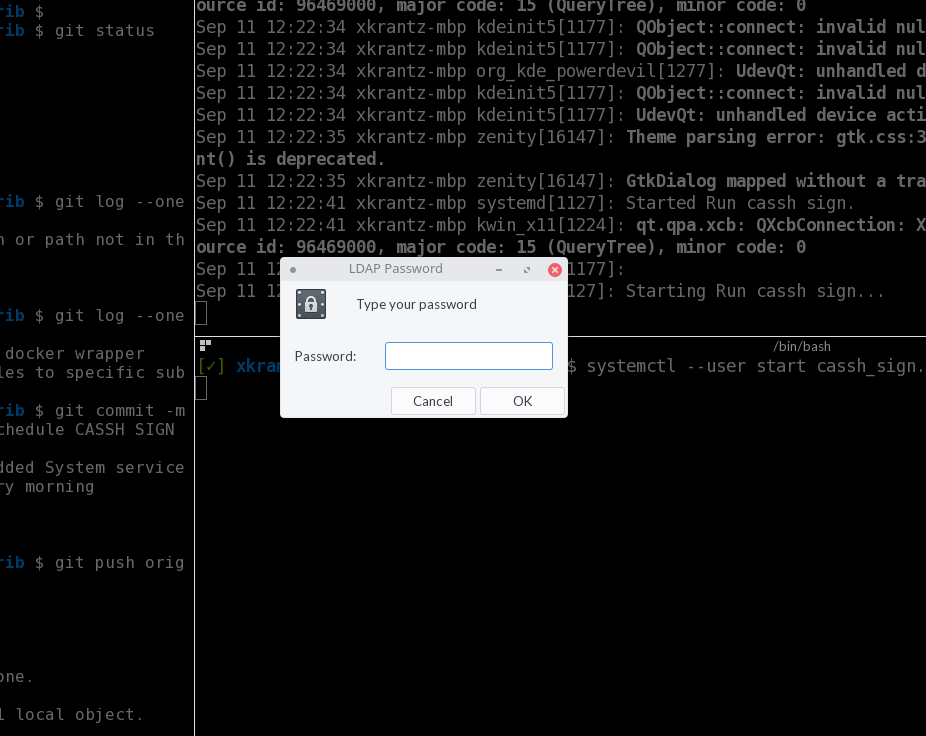
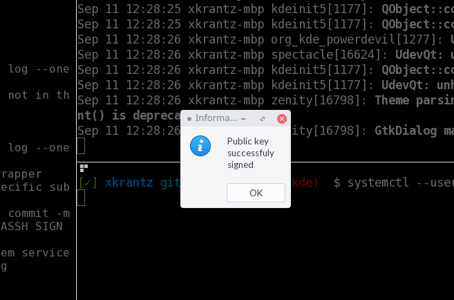
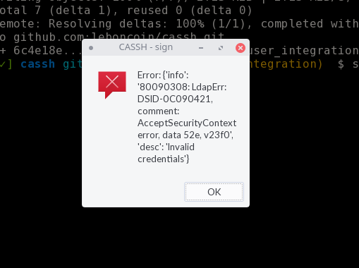

# Contrib files

<!-- START doctoc generated TOC please keep comment here to allow auto update -->
<!-- DON'T EDIT THIS SECTION, INSTEAD RE-RUN doctoc TO UPDATE -->
**Table of Contents**  *generated with [DocToc](https://github.com/thlorenz/doctoc)*

- [Cassh-server](#cassh-server)
  - [Systemd units](#systemd-units)
- [Cassh](#cassh)
  - [Autosign your key everyday with SystemD](#autosign-your-key-everyday-with-systemd)

<!-- END doctoc generated TOC please keep comment here to allow auto update -->

## Cassh-server

### Systemd units

* `cassh-server.service`

SystemD unit files to run `cassh-server` as a service

## Cassh

### Autosign your key everyday with SystemD

Files:
* [`cassh_docker.sh`](./cassh_docker.sh): Shell script using `cassh` client dockerized version and sign your key.
* [`cassh_sign.service`](./cassh_sign.service): SystemD unit that is triggered by the SystemD timer.
* [`cassh_sign.timer`](./cassh_sign.timer): SystemD timer.

> 
> Instructions how to install the systemd unit files are in the files header.
>

Screenshots

